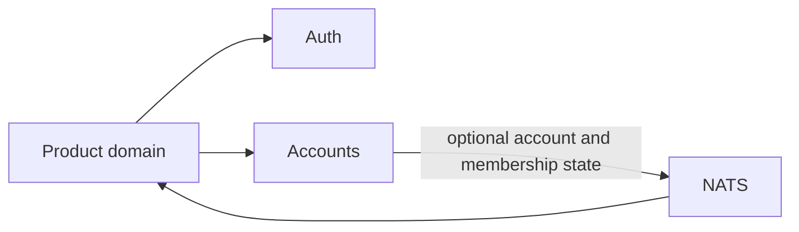

# Aperitif

A Kubernetes foundation for SaaS products built from independently deployable
domains.

Aperitif provides product-agnostic identity and account boundaries. Product
domains compose those capabilities and own their vocabulary, workflows, data and
commercial model.

## Included domains

| Domain                               | Provides                                                                    |
| ------------------------------------ | --------------------------------------------------------------------------- |
| [Auth](docs/domains.md#auth)         | Passkey registration and login, sessions, access tokens and JWKS            |
| [Accounts](docs/domains.md#accounts) | Customer accounts, initial owner membership and an economic attribution key |



A domain owns its database, migrations, API, contracts and Kubernetes manifests.
It exports state through versioned HTTP or NATS contracts; it does not read
another domain’s database.

## Develop

Install the project tools:

```sh
brew bundle
```

Every domain has the same local interface:

| Command                          | Action                                                     |
| -------------------------------- | ---------------------------------------------------------- |
| `make -C domains/<domain> check` | Run package checks and render manifests                    |
| `make -C domains/<domain> up`    | Start its database, run migrations and deploy its runtime  |
| `make -C domains/<domain> dev`   | Start the same environment with Skaffold development loops |
| `make -C domains/<domain> down`  | Delete the domain’s deployed resources                     |

Install only the cluster capability a scenario needs:

```sh
# Browser and HTTP traffic at http://localhost
kubectl apply -k platform/cluster/ingress/overlays/local

# Outbox Relay, NATS state feeds and projections
kubectl apply -k platform/cluster/event-bus/overlays/local
```

For example:

```sh
make -C domains/auth dev
make -C domains/auth e2e
```

## Repository

```text
domains/                 business boundaries and deployable workloads
platform/cluster/        optional cluster capabilities: ingress, NATS and observability
platform/runtime/        shared executable infrastructure without domain rules
clusters/prod-eu/        Flux production inventory and release state
docs/                    domain model, operations, extension recipes and roadmap
```

Workload manifests have a portable base and environment overlays. Domain
Skaffold files compose workloads. Flux composes domains and platform
capabilities into a cluster.

## Delivery

Pull requests check changed units. The current production path is:

```text
master → build immutable SHA image → scan → latest → Flux digest commit → prod-eu
```

Flux reconciles `master` from `clusters/prod-eu`. Its image automation resolves
the scanned image digest, commits that release state back to Git, then applies
the matching production overlay.

## Production secrets

Local overlays use disposable development credentials. Production Secret files are
SOPS-encrypted for the Age recipient selected by [`.sops.yaml`](.sops.yaml).
Private Age identities stay outside Git; bootstrap receives the selected identity
through `SOPS_AGE_KEY_FILE`.
Generate a key using `age`:
```
$ age-keygen --help

$ age-keygen -o key.txt
Public key: age1ql3z7hjy54pw3hyww5ayyfg7zqgvc7w3j2elw8zmrj2kg5sfn9aqmcac8p

$ age-keygen -y key.txt
age1ql3z7hjy54pw3hyww5ayyfg7zqgvc7w3j2elw8zmrj2kg5sfn9aqmcac8p
```

## Documentation

- [Platform guide](docs/README.md) — implemented facts, proposed extensions and examples
- [Domain model](docs/domains.md) — boundaries, contracts and new product domains
- [Operations](docs/operations.md) — local clusters, E2E composition, GitOps and recovery
- [Extension recipes](docs/README.md#proposed-capabilities) — invitations, machine access, personal access tokens and product roles
- [Roadmap](docs/roadmap.md) — remaining foundation work
